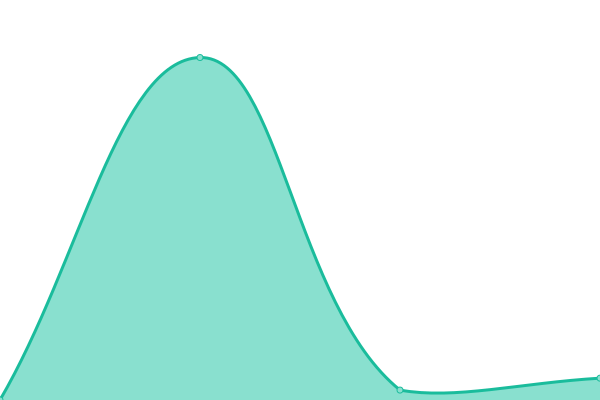

# [📈 Live Status](https://status.transcriptlab.app): <!--live status--> **🟩 All systems operational**

This repository contains the open-source uptime monitor and status page for [TranscriptLab](https://status.transcriptlab.app) by Codifyr Labs, powered by [Upptime](https://github.com/upptime/upptime).

With [Upptime](https://upptime.js.org), you can get your own unlimited and free uptime monitor and status page, powered entirely by a GitHub repository. We use [Issues](https://github.com/codifyrlabs/transcriptlab-status/issues) as incident reports, [Actions](https://github.com/codifyrlabs/transcriptlab-status/actions) as uptime monitors, and [Pages](https://status.transcriptlab.app) for the status page.

<!--start: status pages-->
<!-- This summary is generated by Upptime (https://github.com/upptime/upptime) -->
<!-- Do not edit this manually, your changes will be overwritten -->
<!-- prettier-ignore -->
| URL | Status | History | Response Time | Uptime |
| --- | ------ | ------- | ------------- | ------ |
|  [Marketing site](https://transcriptlab.netlify.app/) | 🟩 Up | [marketing-site.yml](https://github.com/codifyrlabs/transcriptlab-status/commits/HEAD/history/marketing-site.yml) | 

 5286ms
     
 | 

<a href="https://codifyrlabs.github.io/transcriptlab-status/history/marketing-site">34.68%</a>
    

|  [Application (dashboard)](https://transcriptlab.netlify.app/dashboard) | 🟩 Up | [application-dashboard.yml](https://github.com/codifyrlabs/transcriptlab-status/commits/HEAD/history/application-dashboard.yml) | 

 275ms
     
 | 

<a href="https://codifyrlabs.github.io/transcriptlab-status/history/application-dashboard">35.74%</a>
    

|  [API health (Firestore probe)](https://transcriptlab.netlify.app/api/health) | 🟩 Up | [api-health-firestore-probe.yml](https://github.com/codifyrlabs/transcriptlab-status/commits/HEAD/history/api-health-firestore-probe.yml) | 

 557ms
     
 | 

<a href="https://codifyrlabs.github.io/transcriptlab-status/history/api-health-firestore-probe">36.87%</a>
    

|  [Polar billing webhook](https://transcriptlab.netlify.app/api/billing/webhook) | 🟩 Up | [polar-billing-webhook.yml](https://github.com/codifyrlabs/transcriptlab-status/commits/HEAD/history/polar-billing-webhook.yml) | 

 195ms
     
 | 

<a href="https://codifyrlabs.github.io/transcriptlab-status/history/polar-billing-webhook">38.09%</a>
    

|  [Keygen license webhook](https://transcriptlab.netlify.app/api/keygen/webhook) | 🟩 Up | [keygen-license-webhook.yml](https://github.com/codifyrlabs/transcriptlab-status/commits/HEAD/history/keygen-license-webhook.yml) | 

 112ms
     
 | 

<a href="https://codifyrlabs.github.io/transcriptlab-status/history/keygen-license-webhook">39.39%</a>
    

|  [License activation](https://transcriptlab.netlify.app/api/license/activate) | 🟩 Up | [license-activation.yml](https://github.com/codifyrlabs/transcriptlab-status/commits/HEAD/history/license-activation.yml) | 

 106ms
     
 | 

<a href="https://codifyrlabs.github.io/transcriptlab-status/history/license-activation">40.78%</a>
    

<!--end: status pages-->

[**Visit our status website →**](https://status.transcriptlab.app)

## 📄 License

- Powered by: [Upptime](https://github.com/upptime/upptime)
- Code: [MIT](./LICENSE) © [Anand Chowdhary](https://anandchowdhary.com), supported by [Pabio](https://pabio.com)
- Data in the `./history` directory: [Open Database License](https://opendatacommons.org/licenses/odbl/1-0/)
